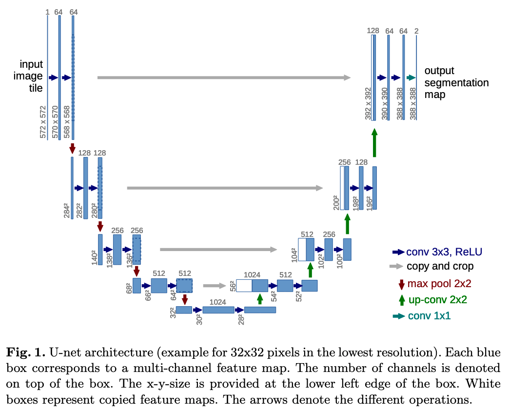
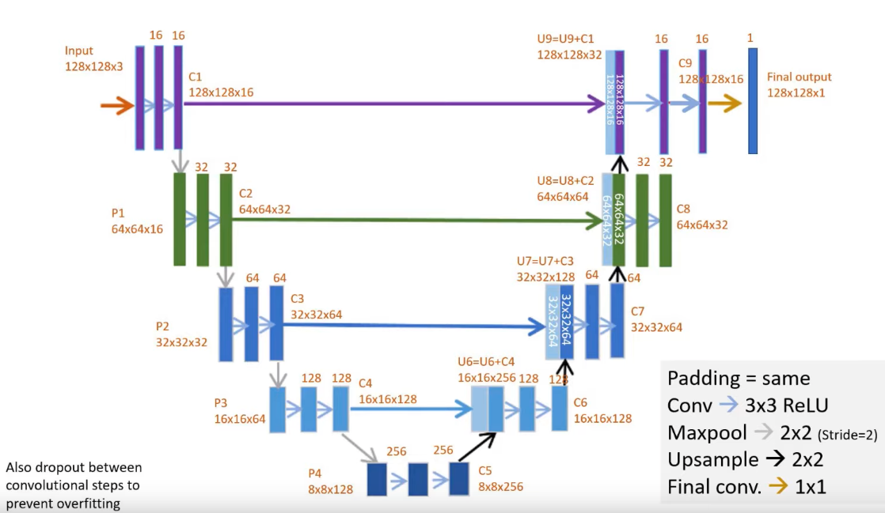

**UNET** is a semantic segmentation model. Here is a [short explanation of it's architecture](https://youtu.be/azM57JuQpQI?t=559).

||
|:-:|
|*The basic unet architecture*[^1]|

## High level TensorFlow model
I started by doing a high level model by following the DigitalSreeni tutorial[^2].
However, he choose to use a slightly modified architecture that I will follow in this high level model.

||
|:-:|
|*The slightly modified unet architecture*|

***

Definitions:
The **semantic segmentation** is the act of classifying every pixel of an image as either belonging to a class or not.
**Instance segmentation** is an extension of this where we identify the different instances of a class.

Steps:
- [ ] Build a high level tf / keras model
- [ ] [Build a low level tf model](https://miguelalba96.github.io/posts/Tensorflow-low-level-API/)
- [ ] Build a model in PyTorch

Questions:
I don't get why we have two convolutions of the same size one after the other on each step.
No he_normal kernel initializer / activation on conv2dTranspose?
Why does the dropout change on the deeper layers?

[^1]: [Unet paper](https://arxiv.org/pdf/1505.04597.pdf)
[^2]: [DigitalSreeni / PythonForMicroscopists video series](https://www.youtube.com/playlist?list=PLZsOBAyNTZwbR08R959iCvYT3qzhxvGOE)